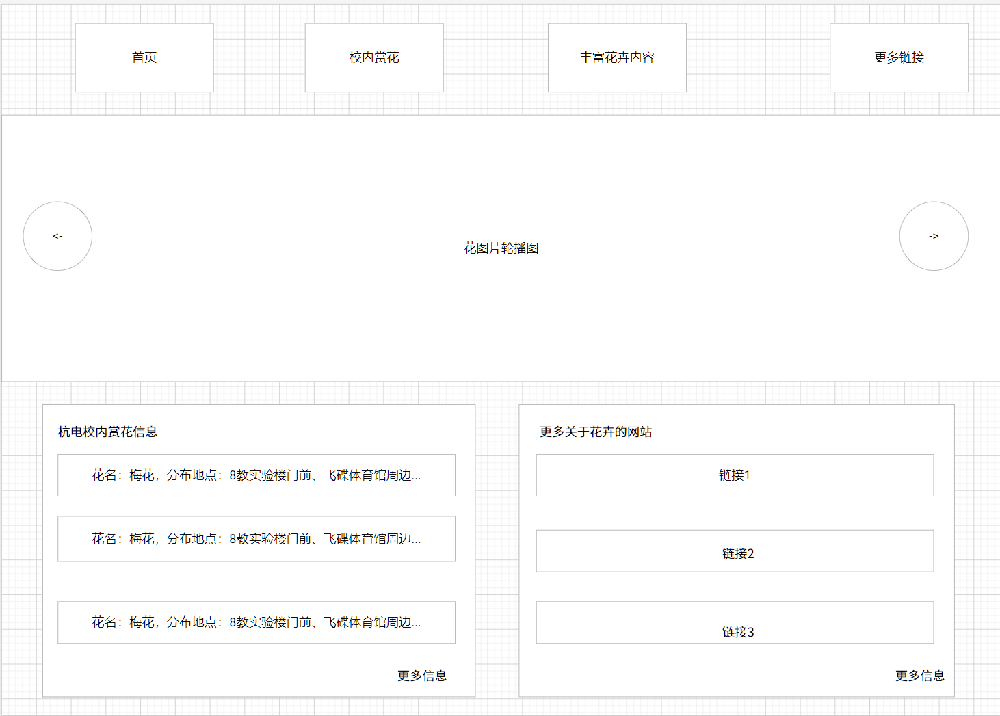
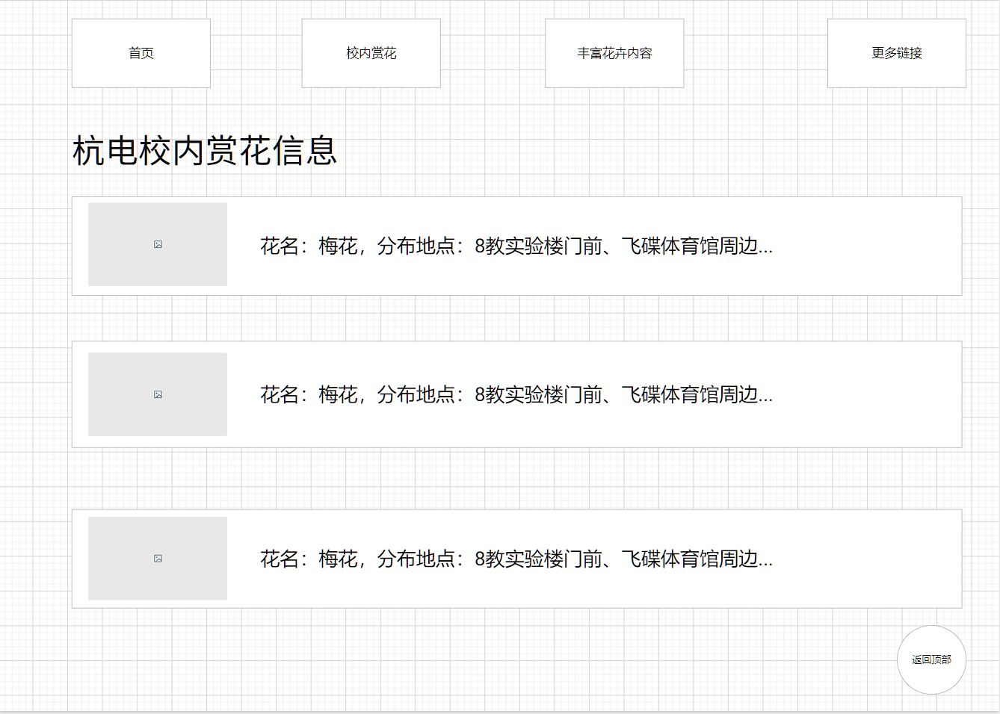
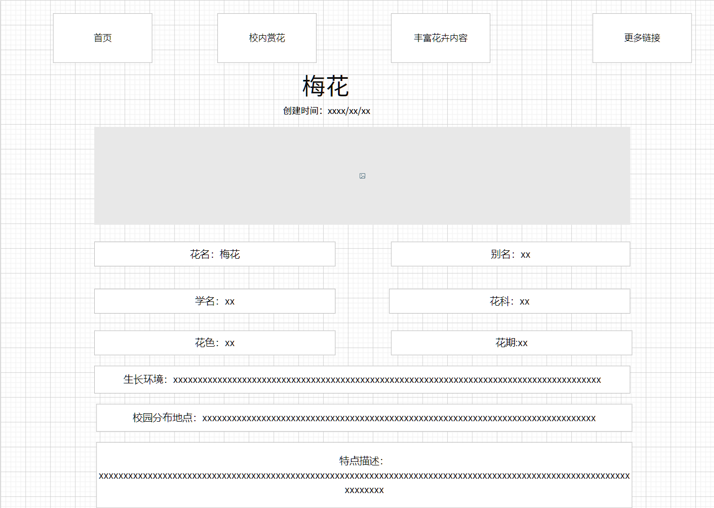
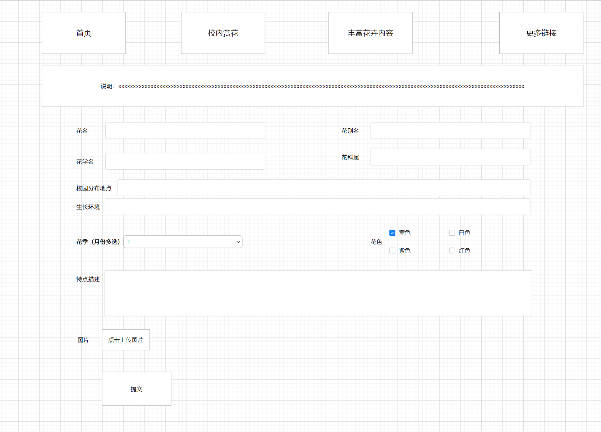
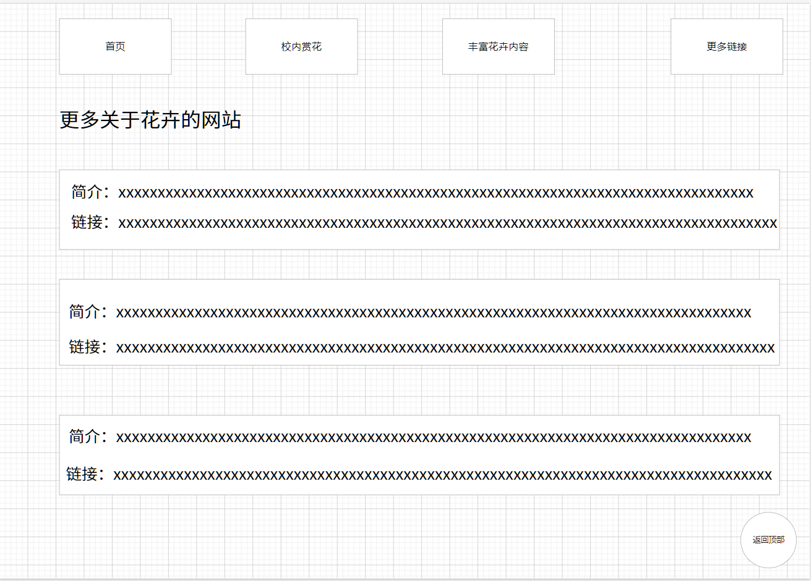

# 项目立项

## 网站概述

杭电电子科技大学赏花网是一个静态网站，旨在展示杭电校园内丰富美丽的花卉景观，提供杭电校园的赏花信息，同学们可以在网站上查看杭电下沙校内各个区域的各种花的介绍和观赏路线。网站包括首页、赏花列表页、赏花详细页、新增花信息的表单页，更多链接页。首页通过轮播图展示校园内的花卉图片，以及展示杭电花卉信息和更多连接的内容聚合。列表页展示花卉基本信息，可以点击进入详细页查看每种花卉的详细信息和高清图片。同学们在校内发现新的花品种，可在网站表单页填写关于花相关信息的表单，共同丰富完善杭电赏花网的内容。在更多链接页收集各种关于花卉的链接，方便同学们了解更多关于花卉的知识。本网站可以丰富和调剂同学们的文化生活，增添乐趣，陶冶性情，审美爱美，还能增加科学知识，提高文化艺术素养。

## 内容来源及素材

- 杭电相关微信公众号和微博文章摘选
  - <https://mp.weixin.qq.com/s/dxbYS__CsEz1Uyw9sZSv2Q>
  - <https://mp.weixin.qq.com/s/XnH4exP1Z2lLvPiw-PyIFQ>
- 实地拍照，识别

## 媒体类型说明

- 文本
- 图片

## 内容字段说明

- 唯一标识 id
- 花名称
- 花别名
- 花学名
- 花科
- 花色
- 花期
- 生长环境
- 图片
- 校园分布地点
- 特点描述
- 发布时间

## 基本界面原型

- 首页
  
- 赏花列表页
  )
- 赏花详细页
  
- 表单页
  
- 更多链接页
  
